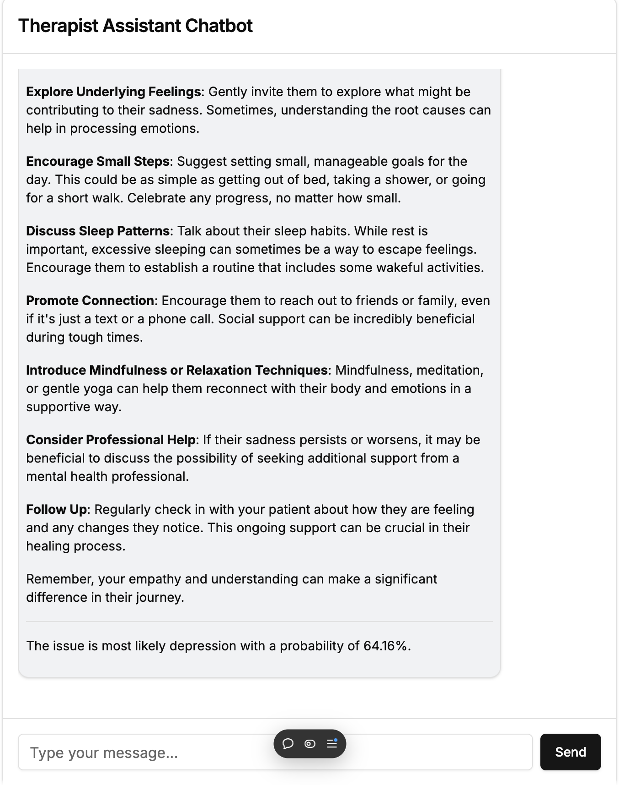

# Therapist Assistant Chatbot

## Introduction

The **Therapist Assistant Chatbot** is an AI-powered application designed to assist counselors by generating insightful advice to support their patients. By integrating advanced language models and machine learning, the chatbot provides personalized suggestions based on the counselor's input. This project aims to enhance the therapeutic process by offering immediate, contextually relevant guidance, thus serving as a valuable tool in mental health support.

## Methods and Results

### Methods

The chatbot is built using **Next.js**, leveraging its capabilities for server-side rendering and seamless frontend-backend integration. Key technologies and components used in the project include:

- **OpenAI's GPT-4o-mini Model**: Utilized for generating human-like, ethical advice tailored to the counselor's inputs.
- **Machine Learning Model Integration**: An external ML model predicts potential issues and provides probability estimations based on the latest counselor input.
- **React Hooks and State Management**: Employed to manage asynchronous data streams and real-time UI updates effectively.
- **Tailwind CSS**: Used for responsive and modern styling of the user interface.
- **Markdown Support**: Implemented using `react-markdown` to render messages with rich text formatting.

**Core Functionalities**:

- **User Input Handling**: Captures counselor inputs and manages state using React hooks.
- **AI Response Generation**: Handles sending messages to the GPT-4o-mini model and streaming the response back.
- **Issue Prediction**: Fetches predictions from the external ML model to augment the AI's advice with potential issue and likelihood.
- **Real-Time Chat Interface**: Renders messages dynamically, auto-scrolls to the latest messages, and adjusts text areas based on content.

### Results

The chatbot effectively generates advice for counselors, enhancing their ability to support patients. The integration with the ML model provides additional context by predicting potential issues related to the patient's inputs.

**Sample Conversation**:




_Figure 1: Example conversation between a counselor and the AI assistant._

In the sample above, the counselor inputs concerns about a patient's sadness. The AI assistant provides tailored advice and indicates that the issue is most likely **Depression** with a probability of **64.16%**.

## Discussion

### Challenges Faced

- **Integration of Multiple AI Services**: Combining responses from OpenAI's GPT-4o-mini model and the external ML prediction service required careful synchronization to provide coherent and timely responses.
- **Asynchronous Data Handling**: Managing real-time data streams and updating the UI without lag was challenging, especially ensuring that state updates didn't cause race conditions or render issues.
- **User Interface Consistency**: Creating a responsive and intuitive UI that adjusts to various screen sizes and input lengths necessitated dynamic styling and component adjustments.

### Lessons Learned

- **Advanced State Management**: Leveraged React hooks like `useState`, `useEffect`, and `useRef` to manage complex state and side effects efficiently.
- **Asynchronous Programming Proficiency**: Improved understanding of async/await patterns, Promises, and handling of streaming data in JavaScript.
- **UI/UX Best Practices**: Recognized the importance of user-centric design, especially in applications dealing with sensitive data, leading to better accessibility and usability.

### Future Work

- **Enhanced ML Predictions**: Incorporate more sophisticated models or additional data sources to improve the accuracy and range of issue predictions.
- **User Authentication and Data Security**: Implement secure authentication mechanisms to protect sensitive information and comply with privacy regulations.
- **Feedback Loop for Continuous Improvement**: Enable counselors to provide feedback on AI responses to refine the models over time.
- **Expanded Language Support**: Add support for multiple languages to serve a broader audience and cater to diverse populations.

## Optional Interactive Elements

### Live Demo

Experience the Therapist Assistant Chatbot by accessing the live demo:

[Live Demo Link](https://therapy-chat.vercel.app)

_Note: Replace the URL with the actual link to your deployed application._

### Deployment Instructions

You can run the chatbot locally or deploy it using a hosting service like Vercel.

**Running Locally**:

1. **Clone the Repository**:

   ```bash
   git clone https://github.com/yourusername/therapist-assistant-chatbot.git
   cd therapist-assistant-chatbot
   ```

2. **Install Dependencies**:

   ```bash
   npm install
   ```

3. **Set Environment Variables**:

   Create a `.env` file in the root directory:

   ```
   MODEL_API_URL=<url_for_ml_model_api>
   OPENAI_API_KEY=<your_openai_api_key>
   ```

   Replace placeholders with your actual API URLs and keys.

4. **Start the Development Server**:

   ```bash
   npm run dev
   ```

5. **Access the Application**:

   Navigate to [http://localhost:3000](http://localhost:3000) in your browser.

**Deploying with Vercel**:

[](https://vercel.com/new/clone?repository-url=https://github.com/yourusername/therapist-assistant-chatbot)

Follow the link above to deploy the application directly to Vercel. Ensure you set up the required environment variables in the Vercel dashboard.
